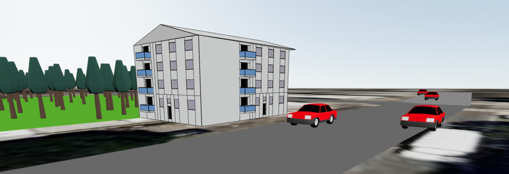

# QuickProBuild

_A Web-based Approach for Quick Procedural 3D Reconstructions of Buildings_

[<h2>⤷ Demo</h2>](https://cc-bbohlender.github.io/cgv)

## Development

1. `npm install` to install the library dependencies
2. `npm run build` to build the cgv library
3. `cd web` to move into the frontend folder
4. `npm run install` to install the frontend dependencies
5. `npm run dev` to start the frontend

`now access http://localhost:3000/cgv to access the respective domain editor`

## Folder Structure

-   `src` contains the source code for the core library including the domains in `src/domains`
-   `web` contains the frontend code in react (the pages for the respective editors)

